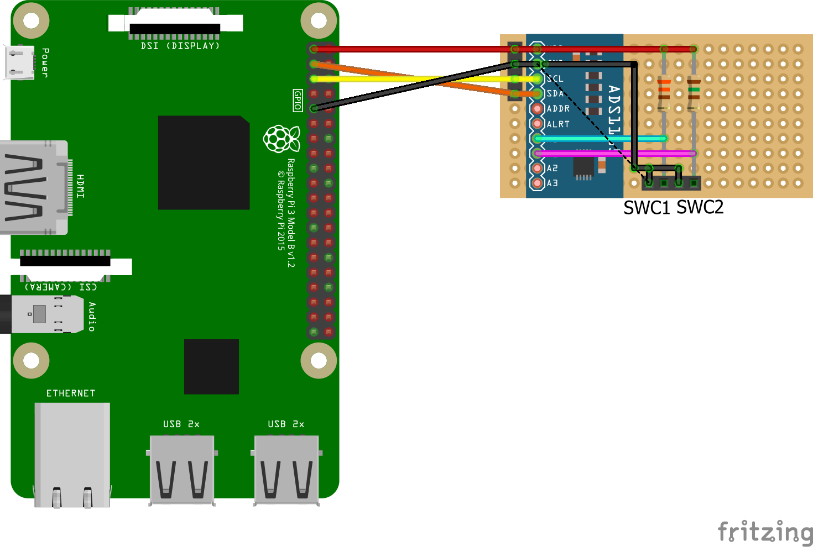

# Steering Wheel Control
This facilitates the use of Subaru Steering Wheel Controls (SWC) with the Pi.


## SWC Resistance Values
For a MY10 Subaru Liberty the resistance values can be found in [this thread](https://www.legacygt.com/topic/66617-2010-aftermarket-nav-steering-wheel-controls-pac-swi-ps-and-pioneer/). I've adjusted the seek back button to match
the resistance that I saw. It comes in 2 parts for Bluetooth based units and we will use a different resistor in each voltage divider (`Vout = Vin * (R2  / (R1 + R2))`).

The media controls will use a 330Ω resistor...
| Button | Res value (Ω) | Output Voltage (V) |
|---------|------------|------------|
| None | 4700 | 3.083 |
| Mute | 22 | 0.206 |
| Vol+ | 90 | 0.707 |
| Vol- | 200 | 1.245 |
| Mode | 360 | 1.722 |
| Seek Fw | 690 | 2.232 |
| Seek Bk | 1159 | 2.705 |


The Bluetooth controls will use a 1.5kΩ resistor...
| Button | Res value (Ω) | Output Voltage (V) |
|---------|------------|------------|
| None | 100000 | 3.251 |
| Phone On | 330 | 0.595 |
| Phone Off | 1000 | 1.320 |
| Talk | 3200 | 2.247 |


## Verify I2C
You can test that I2C is enabled and working on the Pi using the instructions below.
```bash
// check i2c is enabled
raspi-config nonint get_i2c

// check for i2c node
ls /dev/i2c*

// check that i2c modules are loaded
lsmod | grep i2c

// scan for the i2c device
i2cdetect -y 1

// read something from the device on the default address
i2cget -y 1 0x48
```

## Hardware
- ADS1115
- 330Ω resistor
- 1.5kΩ resistor


Refer to [Fritzing file](./assets/swc.fzz) or [this Falstad link](https://www.falstad.com/circuit/circuitjs.html?ctz=CQAgjCAMB0l3BWcMBMcUHYMGZIA4UA2ATmIxAUgpABZsKBTAWjDACgAlEbFEFPPCCY8+AqOJpVs0elTnQEbAObcEvTLxp4qG8ZDYB3EIRp9J3dWP0AnY6Z5UwGQhbndch8M9d8ELh1Bstih+PgEBVDQYcJ7haKrqGLz6AA5e-vFOLpJSerGWgiY+NnZmjt4o5o6UqelldWCEuXKeWfUhLpUtwaFdPn1SaPpGAX3YanxJgdiCSABiEDq8YDVCEADKAOoAwuwz4LwL4ti4rlQsIFvbKGxAA) for wiring details.





